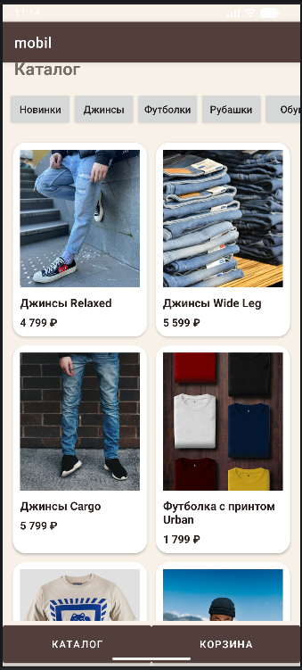
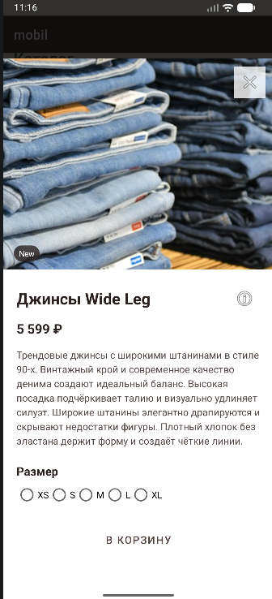
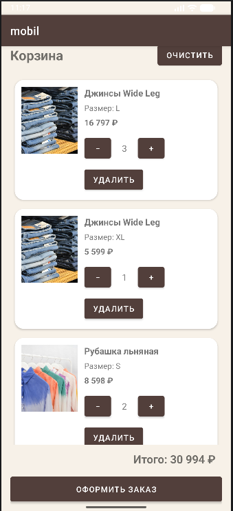
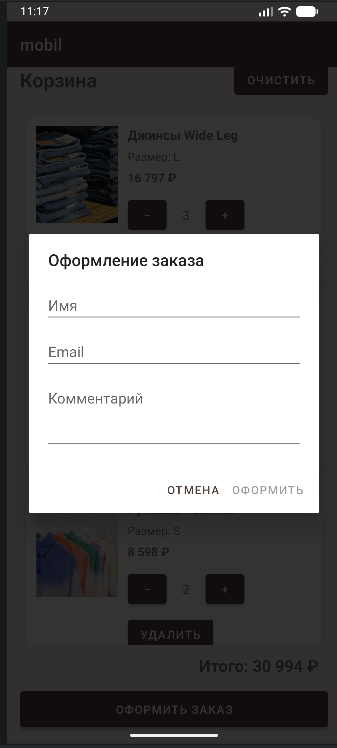

# FEFU Store

Учебное Android-приложение интернет-магазина.

Автор: Гундикова Кристина

Проект выполнен индивидуально.

## Описание проекта

В приложении реализован каталог товаров с фильтрацией по категориям и отдельной категорией «Новинки».

Данные каталога загружаются с API через Retrofit. После успешной загрузки каталог сохраняется в Room, поэтому приложение может работать без интернета. Если сеть недоступна, но сохранённые данные есть, показывается кэшированный каталог. Если кэша нет, отображается экран ошибки с кнопкой повторной загрузки.

При нажатии на товар открывается Bottom Sheet с подробной информацией: изображением, названием, описанием, ценой, тегами, размерами и характеристиками товара.

Пользователь может выбрать размер и добавить товар в корзину.

Корзина хранится в Room. Можно увеличивать и уменьшать количество товара, удалять позиции, очищать корзину и видеть итоговую стоимость. Для одинакового товара с одинаковым размером количество увеличивается, а разные размеры хранятся как отдельные позиции.

Также реализовано оформление заказа. Пользователь вводит имя, email и при необходимости комментарий. Имя и email проходят проверку. После успешного оформления корзина очищается.

В проекте используются Kotlin, XML, ViewModel, LiveData, Retrofit, OkHttp, Gson, Room, Coroutines, Flow, Glide, Material Components, JUnit и ktlint.

## Скриншоты основных экранов

### Каталог



### Детали товара



### Корзина



### Оформление заказа



## Архитектура

Основная схема приложения:

UI → ViewModel → Repository → API / Room

UI отвечает за отображение экранов и действия пользователя.

ViewModel хранит состояние экрана и вызывает Repository.

Repository работает с источниками данных.

API используется для получения каталога с сервера.

Room используется для хранения кэша каталога и корзины.

Каталог сначала может быть получен из локального кэша, после чего приложение пытается обновить его через API.

В таблице корзины сохраняются только:
- id товара;
- id размера;
- количество.

Остальная информация о товаре берётся из каталога.

## Сборка проекта

Для сборки нужно открыть проект в Android Studio и выполнить Gradle Sync.

Минимальная версия Android: API 24.

После этого проект можно собрать через:

Через Android Studio:
Build → Make Project

или

```powershell
.\gradlew.bat assembleDebug
```
Для запуска unit-тестов:
```
.\gradlew.bat test
```
Для проверки ktlint:
.\gradlew.bat ktlintCheck
```text
